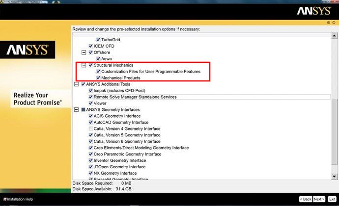

.. _ref_using_standard_install: install_mapdl_

.. _install_mapdl:

*************
Install MAPDL
*************

PyAnsys ``ansys-mapdl-core`` 包 (PyMAPDL) 需要本地或远程的 MAPDL 实例与其通信。
本节将介绍通过从 Python 启动本地实例并与 MAPDL 接口。

MAPDL 默认安装在 Ansys 标准安装程序中。安装 Ansys 时，请确认 **Structural Mechanics** 
选项下的 **Mechanical Products** 复选框已被选中。标准安装程序选项可以更改，请参见下图以供参考。

如果不想在本地安装 MAPDL， 可以使用 Docker。如果您使用的是 MacOS 等不支持的平台，这样做尤其方便。
更多信息，请参阅 :ref:`ref_pymapdl_and_macos`。

您还可以下载并试用 `Ansys 学生版 <ansys_student_version_>`_ 。学生版在一个日历年内有效，
但功能有限。例如，节点和单元的数量会有限制。

如果在 Linux 上安装 MAPDL 时遇到问题，请参阅 :ref:`missing_dependencies_on_linux`。

Ansys software requirements
---------------------------

要使用最新功能，您必须在本地安装 Ansys 2021 R1 或更高版本。不过， PyMAPDL 与 Windows 上的 Ansys 17.0 或更高版本以及 Linux 上的 Ansys 13.0 兼容。不过，我们不鼓励在这些旧版本中使用 PyMAPDL。

.. note::

    最新版本的 Ansys 提供了更好的支持和功能。早期版本的 Ansys 不支持某些功能。

For more information, see :ref:`versions_and_interfaces`.

For information on installing PyMAPDL, see :ref:`ref_pymapdl_installation`.