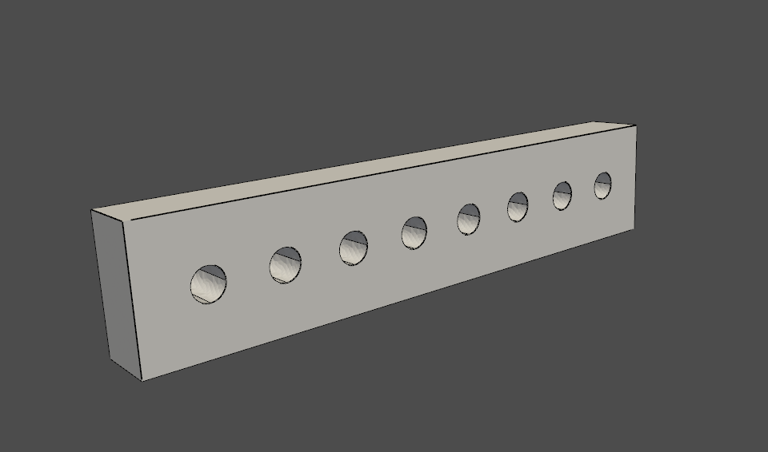

********************
Interactive plotting
********************

在 MAPDL 中从头开始生成几何图形时，通常需要绘制几何图形，如关键点、线、面和体。PyMAPDL 支持使用 VTK 绘制基本 CAD。
:class:`Mapdl <ansys.mapdl.core.mapdl.MapdlBase>` 类利用现有的 MAPDL 命令，提供以下函数，将几何图形传输到 Python 以实现可视化：

- :func:`Mapdl.kplot() <ansys.mapdl.core.Mapdl.kplot>`
- :func:`Mapdl.vplot() <ansys.mapdl.core.Mapdl.vplot>`
- :func:`Mapdl.eplot() <ansys.mapdl.core.Mapdl.eplot>`). 

这些方法依赖于 :func:`ansys.mapdl.core.plotting.general_plotter` 方法。结合 MAPDL 几何图形命令，您可以使用 :func:`open_gui() <ansys.mapdl.core.Mapdl.open_gui>` 方法从头开始生成和可视化几何图形，而无需打开图形用户界面。

Line plotting
~~~~~~~~~~~~~
您可以使用 :func:`Mapdl.lplot() <ansys.mapdl.core.Mapdl.lplot>` 方法在 Python 中绘制线条：

.. code:: python

    >>> from ansys.mapdl.core import launch_mapdl
    >>> mapdl = launch_mapdl()

    创建一个带孔矩形

    >>> mapdl.prep7()
    >>> rect_anum = mapdl.blc4(width=1, height=0.2)

    在矩形中间创建几个圆

    >>> for x in np.linspace(0.1, 0.9, 8):
    ...     mapdl.cyl4(x, 0.1, 0.025)
    ...

    生成线条

    >>> mapdl.lplot(color_lines=True, cpos="xy")

    使用 PyMAPDL 和 `PyVista <pyvista_docs_>`_ 从 MAPDL 绘制线条

Area and volume plotting
~~~~~~~~~~~~~~~~~~~~~~~~

您可以使用 :func:`Mapdl.vplot() <ansys.mapdl.core.Mapdl.vplot>` 方法使用布尔运算获得更复杂的几何图形并将其可视化。本例用八个圆切割初始区域，然后将其挤出。

.. code:: python

    >>> plate_holes = mapdl.asba(rect_anum, "all")

    挤出该面域

    >>> mapdl.vext(plate_holes, dz=0.1)
    >>> mapdl.vplot()

    使用 PyMAPDL 和 `PyVista <pyvista_docs_>`_ 从 MAPDL 绘制体积图

Node and element plotting
~~~~~~~~~~~~~~~~~~~~~~~~~

您可以直接从 :class:`Mapdl <ansys.mapdl.core.mapdl.MapdlBase>` 类的实例中绘制节点和单元。这段代码定义了一些单元类型，执行网格划分，然后显示网格：

.. code:: python

    >>> mapdl.et(1, "SOLID186")
    >>> mapdl.vsweep("ALL")
    >>> mapdl.esize(0.1)
    >>> mapdl.eplot()

.. figure:: ../images/eplot_vtk.png
    :width: 400pt

    使用 PyMAPDL 和 `Pyvista <pyvista_docs_>`_ 从 MAPDL 绘制单元

Plotting non-interactively using MAPDL
--------------------------------------

您还可以使用 MAPDL 的本地绘图工具进行绘图。要使用本地工具，请在运行绘图命令（如 :func:`Mapdl.aplot <ansys.mapdl.core.Mapdl.aplot>` 和 :func:`Mapdl.eplot <ansys.mapdl.core.Mapdl.eplot>` 方法）时输入 ``vtk=False``。
绘图在 MAPDL 中生成，然后使用 `Matplotlib <matplotlib_main_>`_ 显示。

启动 PyMAPDL

.. code:: python

    >>> from ansys.mapdl.core import launch_mapdl
    >>> mapdl = launch_mapdl()

利用关键点创建正方形区域

.. code:: python

    >>> mapdl.prep7()
    >>> mapdl.k(1, 0, 0, 0)
    >>> mapdl.k(2, 1, 0, 0)
    >>> mapdl.k(3, 1, 1, 0)
    >>> mapdl.k(4, 0, 1, 0)
    >>> mapdl.l(1, 2)
    >>> mapdl.l(2, 3)
    >>> mapdl.l(3, 4)
    >>> mapdl.l(4, 1)
    >>> mapdl.al(1, 2, 3, 4)

将视图设置为“等轴测”

.. code:: python

    >>> mapdl.view(1, 1, 1, 1)
    >>> mapdl.pnum("kp", 1)  # enable keypoint numbering
    >>> mapdl.pnum("line", 1)  # enable line numbering

每项操作都会创建一个 Matplotlib 图形并暂停执行。

.. code:: python

    >>> mapdl.aplot(vtk=False)
    >>> mapdl.lplot(vtk=False)
    >>> mapdl.kplot(vtk=False)

.. figure:: ../images/aplot.png
    :width: 400pt

    使用 `Matplotlib <matplotlib_main_>`_ 显示来自 MAPDL 的面积图

有关绘图函数的更多信息，请参阅 :ref:`ref_plotting_api`。

Plotting keyword options
~~~~~~~~~~~~~~~~~~~~~~~~

默认情况下，当 ``vtk=True`` 时，所有 MAPDL 绘图方法都允许输入额外的关键字参数，以便更好地控制绘图。例如，您可以使用此代码自动生成区域图或元素图的截图：

.. code:: python

    >>> mapdl.aplot(savefig="aplot.png")
    >>> mapdl.eplot(savefig="eplot.png")

当您想从标准视角查看时，也可以使用 ``cpos`` 控制摄像机的位置。这段代码展示了如何使用 ``cpos='xy'`` 查看 XY 平面。

.. code:: python

    >>> mapdl.eplot(cpos="xy")

有关所有常规绘图选项，请参阅 :func:`ansys.mapdl.core.plotting.general_plotter` 方法。

Plotting boundary conditions
~~~~~~~~~~~~~~~~~~~~~~~~~~~~

.. warning::
   该功能为测试版，因此其功能性和稳定性有限。有关允许的边界条件和目标，请参阅文档。

可以通过在绘图函数中指定 ``plot_bc=True`` 来绘制应用于模型的边界条件。例如，此代码为 :func:`Mapdl.nplot() <ansys.mapdl.core.Mapdl.nplot>` 方法指定了 ``plot_bc=True``：

.. code:: python

    >>> mapdl.nplot(
    ...     plot_bc=True, plot_labels=True, savefig=f"bc_plot.png", bc_labels="mechanical"
    ... )

.. figure:: ../images/bc_plot.png
    :width: 500pt

    **Mechanical boundary conditions**
    力（箭头）和位移（锥体）

.. note::
    由于边界条件只能以节点为目标，因此只能在 :func:`Mapdl.nplot() <ansys.mapdl.core.Mapdl.nplot>` 方法中使用 ``plot_bc`` 作为参数。

.. figure:: ../images/bc_plot_2.png
    :width: 500pt

    **Boundary conditions demonstration**
